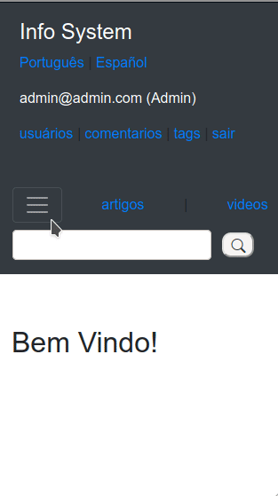

# Info system

## Informações:
Sistema de provisão de conteúdo desenvolvido com o propósito de entregar projeto para processo seletivo em tempo restrito.

Esse projeto teve o intuito de sanar os requisitos estipulados como:

* Aplicação web, utilizando frameworks.
* Sistema de cadastro/login.
* CRUD de vídeo.
* CRUD de artigos.
* Criação de comentários.
* Sistema de tags.
* Sistema de amizade entre usuários.
* Sistema de gerenciamento de usuários(Tornar Admin ou banir).
* Sistema de moderação de comentários.
* Internacionalização - Sistema tanto em pt-BR como es.
* Separação de features baseada no idioma.
* Sistema de avaliação de conteúdo (likes).
* Busca de conteúdo.

O Sistema se encontra em estágio inicial de desenvolvimento.

Algumas propostas futuras de desenvolvimento seriam:
* Revisão de código
* Implementar mais testes
* Possível refatoração de front-end
* Melhorar desempenho das features(ex: passar para js/ajax certas features)
* entre outros...

## Tecnologias envolvidas no projeto:
* Ruby
* Rails
* HTML
* CSS
* JavaScript
* BootStrap
* Rspec
* Rubocop
* FactoryBot
* Devise
* PostgreSQL
* Linux
* Github
* Carrierwave

## Default credentials:
*in a real world scenario, it should be changed right after first login
```
(*seed)
admin:

email: admin@admin.com
password: admin123

```

## Screens:


